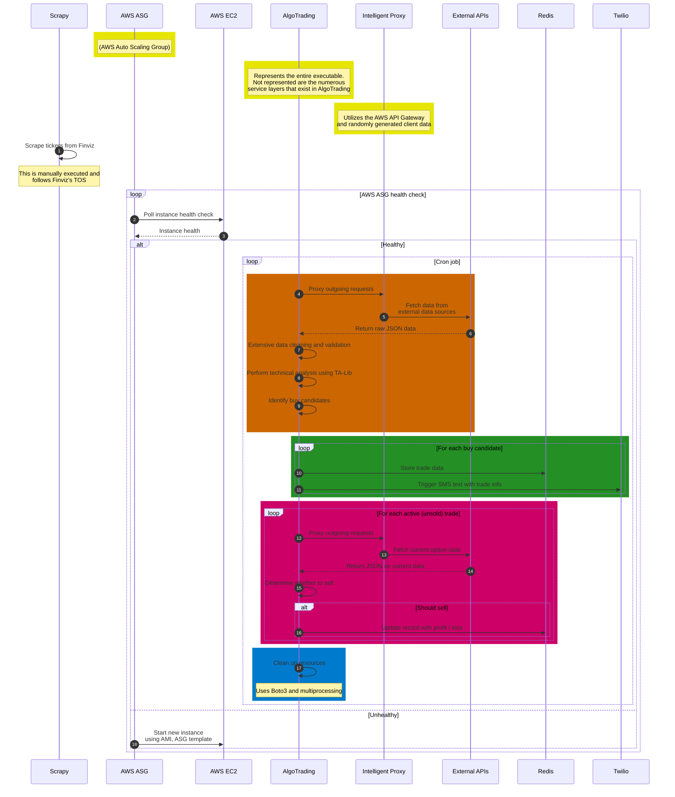

```mermaid
sequenceDiagram
    autonumber
    participant Scrapy
    
    participant AWS ASG
    rect rgb(230, 230, 0)
    Note over AWS ASG: (AWS Auto Scaling Group)
    end
    
    participant AWS EC2
    
    participant AlgoTrading  
    rect rgb(230, 230, 0)
    Note over AlgoTrading: Represents the entire executable. <br> Not represented are the numerous <br> service layers that exist in AlgoTrading
    end
  
    participant IP as Intelligent Proxy
    rect rgb(230, 230, 0)
    Note over IP: Utilizes the AWS API Gateway <br> and randomly generated client data
    end

    participant External APIs
    participant Redis
    participant Twilio
    
    %% Scrapy
    Scrapy->>Scrapy: Scrape tickers from Finviz
    Note over Scrapy,Scrapy: This is manually executed and <br> follows Finviz's TOS
   
   %% Main sequence flow
    loop AWS ASG health check
        AWS ASG ->> AWS EC2: Poll instance health check
        AWS EC2 -->> AWS ASG: Instance health
        
        alt Healthy
            loop Cron job
                
                rect rgb(204, 102, 0)
                AlgoTrading ->> IP: Proxy outgoing requests
                IP ->> External APIs: Fetch data from <br> external data sources
                External APIs -->> AlgoTrading: Return raw JSON data
                AlgoTrading ->> AlgoTrading: Extensive data cleaning and validation
                AlgoTrading ->> AlgoTrading: Perform technical analysis using TA-Lib
                AlgoTrading ->> AlgoTrading: Identify buy candidates
                end
                
                rect rgb(36, 143, 36)
                loop For each buy candidate
                    AlgoTrading ->> Redis: Store trade data
                    AlgoTrading ->> Twilio: Trigger SMS text with trade info
                end
                end
                
                rect rgb(204, 0, 102)
                loop For each active (unsold) trade
                    AlgoTrading ->> IP: Proxy outgoing requests
                    IP ->> External APIs: Fetch current option data
                    External APIs -->> AlgoTrading: Return JSON on current data
                    AlgoTrading ->> AlgoTrading: Determine whether to sell
                    alt Should sell
                        AlgoTrading ->> Redis: Update record with profit / loss
                    end
                end
                end
                
                rect rgb(0, 122, 204)
                AlgoTrading ->> AlgoTrading: Clean up resources
                Note over AlgoTrading,AlgoTrading: Uses Boto3 and multiprocessing
                end
            end

        else Unhealthy
            AWS ASG ->> AWS EC2: Start new instance <br> using AMI, ASG template
        end
    end
```
